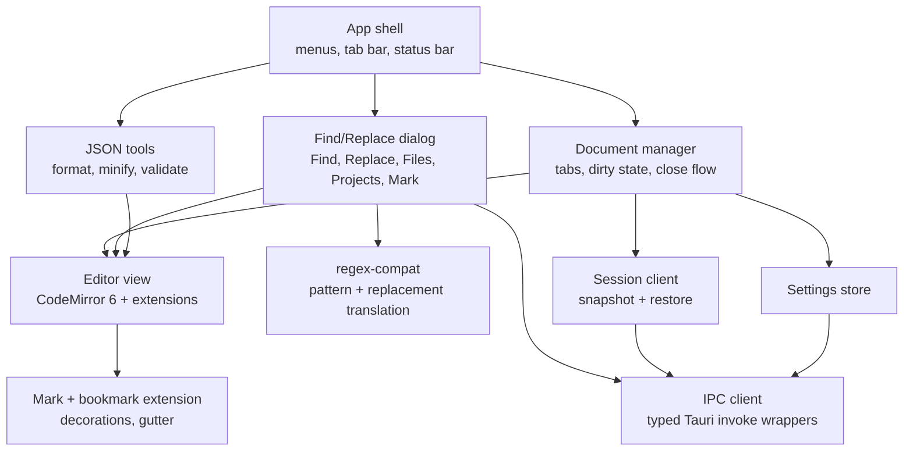
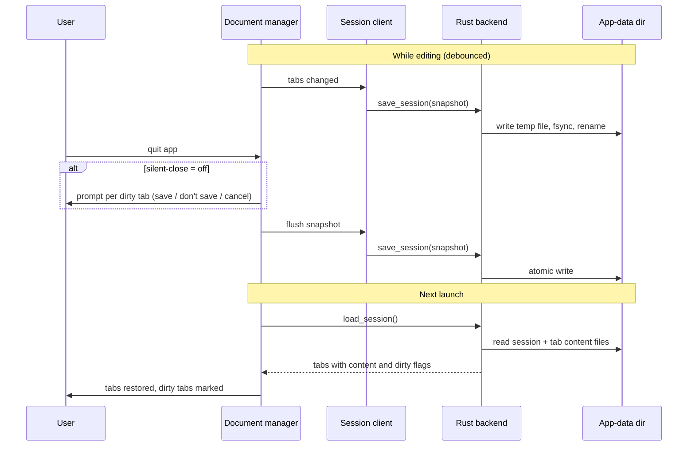

## Context

The repo's existing Notepad++ sources are Win32/C++ and cannot run on macOS or Linux. This change adds a new app, `notepad-next/`, that reproduces the core Notepad++ experience on macOS, Linux and Windows from one codebase (see `proposal.md`). It is greenfield: no existing code in `notepad-next/`, and no ADRs exist yet (`<repo>/adr/` is absent), so no prior decisions constrain this design.

Constraints from the grilling session: Tauri 2 + CodeMirror 6 (TypeScript); macOS first, CI on all three OSes; spec-driven and test-driven delivery; silent session restore of all tabs' contents (not cursor, scroll or undo history); Find in Files uses Rust-side search.

Diagrams below are plain Mermaid, hybrid C4: a container diagram, a frontend component diagram and a dynamic diagram for session save/restore. Code and deployment levels are skipped because they would not answer a real question yet.

### Container diagram

```mermaid
flowchart LR
    user([User])
    subgraph app["notepad-next (Tauri 2 app)"]
        ui["Frontend webview<br/>TypeScript + CodeMirror 6"]
        core["Backend core<br/>Rust: Tauri commands"]
    end
    fs[("Filesystem<br/>user files")]
    store[("App-data directory<br/>session + settings")]
    user -->|keyboard, mouse| ui
    ui -->|invoke / events (IPC)| core
    core -->|read, write, walk| fs
    core -->|atomic write / read| store
```

### Component diagram: frontend container



### Dynamic diagram: session save and restore



## Goals / Non-Goals

**Goals:**
- One TypeScript/Rust codebase that builds for macOS, Linux and Windows.
- Notepad++-grade Find/Replace (all five tabs, three search modes, all options and actions).
- Never lose unsaved text: all tabs survive quit and crash via the session store.
- Every capability developed test-first, with the same behaviour spec'd in `specs/`.

**Non-Goals:**
- Plugins, macros, Run menu, Document Map, split view, Function List, UDL editor, JSON tree view (follow-up changes).
- Restoring cursor, scroll or undo history.
- Binary-compatible Notepad++ config, theme or session files.
- Full PCRE parity for in-editor regex (JS flavour is the reference).

## Decisions

**D1. Tauri 2 + CodeMirror 6 over Flutter or Qt/Scintilla.**
CodeMirror 6 supplies multi-cursor, rectangular selection, folding, a language system, and handles large documents through a virtualised viewport. Tauri keeps the binary small and gives a Rust backend for file I/O and search. *Alternatives:* Flutter (no mature editor widget; editor core would be custom), Qt + Scintilla (closest to Notepad++, but slower to build and harder to unit-test), Electron + Monaco (heavier runtime, same web editor idea).

**D2. Rust owns the filesystem and the session store; the frontend owns editor state.**
All file open/save, directory walking and session persistence go through typed Tauri commands. The frontend never touches the disk directly, which keeps the permission surface small and makes the backend testable with `cargo test`. *Alternative:* the Tauri fs plugin from JS (less code, weaker testing and a wider capability surface).

**D3. Session store layout: one `session.json` plus one content file per tab.**
`session.json` lists tabs (id, title, path or null, encoding, EOL, language, dirty flag, content file name). Each tab's text lives in `tabs/<id>.txt`, so large tabs do not rewrite a big JSON blob on every snapshot. All writes use write-temp, fsync, rename, so a crash cannot leave a half-written store. The app-data directory comes from Tauri's platform path API. *Alternatives:* SQLite (overkill for this volume), one JSON file with embedded content (rewrites everything on each snapshot).

**D4. Snapshots are debounced while editing, plus a final flush on quit.**
The user asked for restore on quit, but snapshotting only at quit would lose data on a crash. A debounce of about 2 seconds after the last change plus a flush on quit covers both. Saved, clean tabs store only the file path; dirty tabs and untitled tabs store content. *Risk:* disk churn on very large dirty tabs (see Risks).

**D5. Close behaviour is governed by a `silentClose` setting (default off).**
- Off: closing a dirty tab prompts save / don't save / cancel; quitting prompts for each dirty tab, and the snapshot is written after the user answers.
- On: no prompts. Quit writes the snapshot; closing a single dirty tab moves its content to a bounded "recently closed" list in the session store so the text is recoverable.
*Alternative:* silent mode simply discards a single closed tab's text, which conflicts with "never loses data" and was rejected.

**D6. `regex-compat` layer owns pattern and replacement translation.**
Notepad++ users write PCRE-style patterns. The layer takes (pattern, replacement, mode, flags) and emits an engine-specific form:
- Normal: escape the text. Extended: expand `\n \r \t \0 \xNN` first, then escape. Regular expression: translate `\h`, `\R`, `\x{..}`, `(?<n>)` to `(?P<n>)` for Rust, and map `\1` and `$1` in replacements.
- Detect lookahead, lookbehind and backreferences, which Rust's `regex` crate does not support, and report `needsJsEngine = true`.
JS regex is the reference semantics for in-editor Find/Replace. A shared table of test cases runs through both engines and must agree wherever the Rust engine is eligible. *Alternative:* a PCRE2 engine everywhere (full parity, but extra native/WASM dependency); kept as a future option if the translation layer proves too leaky.

**D7. Find in Files: Rust walks and reads; matching runs in Rust when eligible, otherwise in JS.**
Rust returns file contents (or streams them in chunks) for patterns flagged `needsJsEngine`, and the frontend matches them with the JS regex. Eligible patterns run entirely in Rust for speed. Both paths produce the same result shape. Find in Projects reuses this with the root set by "Open Folder". Directory walking honours the filters, "in all sub-folders", and "in hidden folders" options. Results are streamed to the results panel, and the search is cancellable.

**D8. Marks and bookmarks are CodeMirror extensions.**
Marks use a `StateField` of decorations (five styles = five CSS classes); bookmarks use a gutter marker field. Both survive edits through CodeMirror's change mapping. "Clear marks" and "Purge for each search" are state effects.

**D9. JSON tools run in the frontend with an in-house strict parser.**
`JSON.parse` gives no error position in Safari/WKWebView, reorders integer-like keys and rounds big numbers, so `src/json/jsonTools.ts` parses RFC 8259 JSON itself, reports line and column of the first error, and prints from its own tree: number text, string escapes and key order are kept as written. Duplicate keys collapse (first position, last value), as in an object literal. Pretty-print and Minify are single undoable edits and never touch invalid JSON. Highlighting uses `@codemirror/lang-json`. Very large JSON may move to a Rust worker later.

**D10. Encodings and line endings.**
Detect on open (BOM, then UTF-8 validity, then fallback) in Rust with `encoding_rs`; the editor stores text as UTF-16/JS strings with the encoding and EOL held as per-document metadata for round-trip saving. The status bar shows both.

**D11. Test strategy (TDD).**
- Vitest: `regex-compat`, JSON tools, document manager and session client logic, mark extensions.
- `cargo test`: session store (atomic write, crash recovery), file walker, encoding detection, search engine.
- WebdriverIO + `tauri-driver`: end-to-end flows (quit/relaunch restore, find/replace dialog, JSON format, close prompts).
- GitHub Actions matrix on macOS, Windows and Linux.
Each spec scenario maps to at least one test.

## Risks / Trade-offs

- [Find in Files regex differs from in-editor regex] -> Translation layer plus JS fallback for lookaround and backreferences; shared cross-engine test table.
- [Debounced snapshots rewrite large dirty tabs repeatedly] -> One file per tab, only changed tabs rewritten, debounce interval configurable; revisit with a size threshold.
- [CodeMirror performance on files above roughly 50 MB] -> Define a documented large-file limit; consider a read-only or truncated mode later. Scintilla would handle this better but was rejected for build cost.
- [Webview differences between WKWebView, WebView2 and WebKitGTK] -> Keep to well-supported web APIs; run end-to-end tests in CI on all three.
- [Session store corruption] -> Atomic rename writes, and load falls back to an empty session while quarantining the bad file instead of crashing.
- [Silent mode could hide unsaved work] -> Dirty indicators remain visible; recently-closed list is recoverable.
- [`tauri-driver` has no macOS WebDriver support] -> macOS end-to-end tests may need a different driver or run only on Linux and Windows in CI; see Open Questions.

## Migration Plan

Greenfield app, so there is nothing to migrate and nothing existing to roll back; the Windows sources are untouched. Delivery order: scaffold and CI, editor core and tabs, session store, regex-compat, Find/Replace (current document), mark, Find in Files/Projects, JSON tools, settings. Rollback is reverting the `notepad-next/` directory.

## Open Questions

Resolved during implementation:

- **macOS end-to-end tests:** `tauri-driver` has no macOS support, so UI flows run in Playwright WebKit against the Vite dev server with an in-memory host (see `notepad-next/README.md`). Linux/Windows `tauri-driver` + WebdriverIO is a follow-up.
- **Recently-closed list UI:** not in this change. In silent-close mode the text is kept in the session store (bounded to 20) and survives restarts; a "Reopen closed tab" UI is a follow-up.
- **Large-file threshold:** 50 MB by default, configurable in Settings; the warning never blocks when the size is unknown.
- **App name / bundle identifier:** working name `notepad-next`, identifier `com.notepadnext.app`. Whether a product name may contain "Notepad++" (trademark) is **still open** and needs the owner's decision before any release.
- **Menus:** an in-page menu bar is used on all platforms (consistent and testable). A native macOS menu bar is a follow-up.
- No in-force ADRs were superseded; ADR-0001 to ADR-0003 stand.
